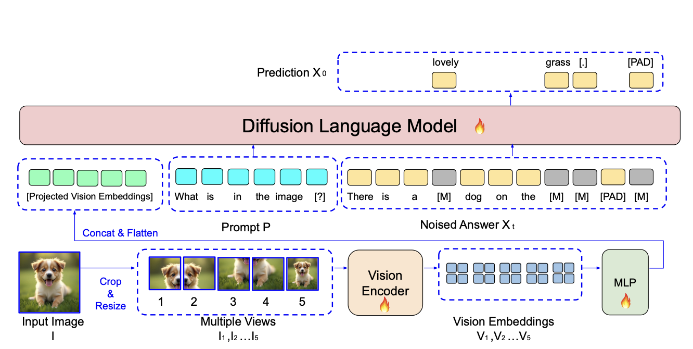

# LaViDa:A Large Diffusion Language Model for Multimodal Understanding

[[Paper]](paper/paper.pdf)[[Checkpoints]](https://huggingface.co/collections/jacklishufan/lavida-10-682ecf5a5fa8c5df85c61ded)[[Data]](https://huggingface.co/datasets/jacklishufan/lavida-train) [[Website]](https://homepage.jackli.org/projects/lavida/)





### Installation

```
conda create --name lavida python=3.13
conda activate lavida
pip install -e .[train]
cd eval
pip install -e .
cd ../
```

### Download Checkpoint

Please download checkpoints from [Huggingface](https://huggingface.co/collections/jacklishufan/lavida-10-682ecf5a5fa8c5df85c61ded)  and organize them in the following structure
```
<repo root>
--lavida-ckpts
   --lavida-llada-hd # jacklishufan/lavida-llada-v1.0-instruct
   --lavida-dream-v1.0-instruct # jacklishufan/lavida-dream-hd
   --lavida-llada-hd-fim  # jacklishufan/lavida-llada-1.0-fim
   --lavida-llada-hd-reason # hbXNov/lavida-llada-reason
   --lavida-llada-lowres  # jacklishufan/lavida-llada-1.0-lowres
```

## Inference
run the following script to perfom standard inference and text-infilling
```
python predict.py
python predict_fim.py
```
## Evaluation
### Reproduce Main Evaluation Results

| Model         | MME    | MMMU | MMB  | Latency (s/image) |
|---------------|--------|------|------|-------------------|
| LaViDa-Dream  | **1463.5** | 42.6 | **73.8** | **1.13**              |
| LaViDa-LLaDa  | 1365.6 | **43.3** | 70.5 | 1.32              |
| [MMaDa](MMaDa)         | 1410.7 | 30.2 | 68.5 | 3.93             |

(speed measurement conducted with generation length=32 and steps=16)

The evaluation scrips are under `eval` folder. Please use the following script to reproduce the main results on MMMU.

```
bash eval/run.sh lavida-ckpts/lavida-llada-hd --tasks mmmu_val # for LaViDa-LLaDa
bash eval/run_dream.sh lavida-ckpts/lavida-dream-hd --tasks mmmu_val # for LaViDa-Dream
```


To reproduce results on other dataset, simply replace `mmmu_val` to respective dataset.

### Reproduce COCO Caption Results (Speed-Quality Tradeoff)


```
bash eval/run_coco.sh lavida-ckpts/lavida-llada-hd 
```

| Model   | KV Cache | CIDEr $\uparrow$ | Latency $\downarrow$  | NFE  |
|------------|----------|-------|---------|-----|
| LaviDa-LLaDa  | off      | 110.2 | 6.65    | 100\%  |
| LaviDa-LLaDa  | on      | 107.8 |  2,01   | 100\%  |
| LaviDa-LLaDa  | off      | 108.5 | 3.57    | 50\%  |
| LaviDa-LLaDa  | on       | 104.4 | 1.32    | 50\%  |
| LLaVa-1.6-7B (Baseline)  | on       |  96.7 | 1.67     | 100\%|

We find that the low resolution model is slightly faster than HD model and have stronger performance on some tasks (e.g. COCO captioning). We provide the inference script as well.

```
bash eval/run_coco_lowres.sh lavida-ckpts/lavida-llada-lowres 
```


## Training
### Data Preparation

The expected data folder structure looks like the following

```
<repo root>
--data
   --pretrain # LCS-558K
      -- images
      -- blip_laion_cc_sbu_558k.json
   --Open-LLaVA-NeXT
      -- ai2d
      -- ...
      -- open-llava-next 
   --infovqa-v1
   --VQAv2_train
```


1. Download [LCS-558K](https://huggingface.co/datasets/liuhaotian/LLaVA-Pretrain/tree/main) and place it in `data/pretrain`
2. Download all datasets from [Open-LLaVa-Next](https://github.com/xiaoachen98/Open-LLaVA-NeXT/blob/master/docs/Data.md) and place it in `data/Open-LLaVa-Next`
3. Download the remaining datasets from [Our Huggingface](https://huggingface.co/datasets/jacklishufan/lavida-train/tree/main). This dataset contains three subfolders

```
infovqa-v1 -> put under data/
VQAv2_train -> put under data/
open-llava-next -> put under data/Open-LLaVA-NeXT/, merge with an existing folder of same name
```

### Launch Scripts

```
Pretrain Scripts:
scripts/train/exps/cluster/pretrain_llada.sh
scripts/train/exps/cluster/pretrain_dream.sh

Finetune Scripts

scripts/train/exps/cluster/llada-hd-llada-s2
scripts/train/exps/cluster/llada-hd-dream-s2.sh
```


### Acknowledgements

This repo is largely based on [LLaVa-Next](https://github.com/LLaVA-VL/LLaVA-NeXT). We use [LMMS-Eval](https://github.com/EvolvingLMMs-Lab/lmms-eval) for evaluations. 